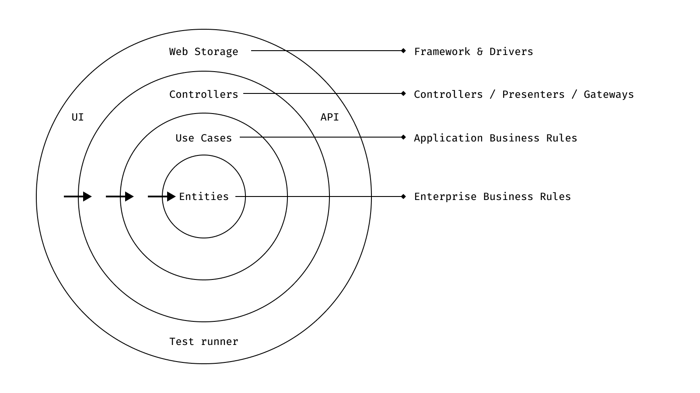
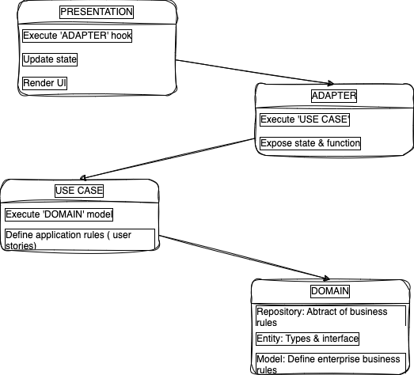

# Clean Architecture

## Folder style ❤️
<pre>
.
├── modules
│   ├── transaction
│   │   ├── adapters
│   │   │   ├── index.ts
│   │   │   ├── useCreateTransactionAdapter.ts
│   │   │   ├── useDeleteTransactionAdapter.ts
│   │   │   └── useGetAllTransactionAdapter.ts
│   │   ├── domains
│   │   │   ├── transaction.entity.ts
│   │   │   ├── transaction.model.ts
│   │   │   └── transaction.repository.ts
│   │   ├── presentations
│   │   │   ├── TransactionCreate
│   │   │   │   ├── index.tsx
│   │   │   │   ├── style.css
│   │   │   │   └── TransactionCreate.tsx
│   │   │   ├── TransactionList
│   │   │   │   ├── index.tsx
│   │   │   │   ├── style.css
│   │   │   │   ├── TransactionItem.tsx
│   │   │   │   └── TransactionList.tsx
│   │   │   └── .DS_Store
│   │   ├── use-cases
│   │   │   ├── createTransactionUseCase.ts
│   │   │   ├── deleteTransactionUseCase.ts
│   │   │   └── index.ts
│   │   └── helper.ts
│   └── user
│      
├── utils
│   ├── dateUtil.ts
│   ├── exceptionUtil.ts
│   └── toastUtil.ts
├── App.test.tsx
├── App.tsx
├── index.css
└── index.tsx

</pre>

## Flow 💪

## Usage 🐾

1. Presentation
    
        export default Feature(){
            const {state, handleSomething} = useAdapter()

            return (
                <button onClick={handleSomething}>
                {state}
                </button>
            )
        }
2. Adapter

        import someUseCase from "../use-cases"
        
        export default useAdapter(service: ServiceRepository){
            const [state, setState] = useState();

            const handleSomething = ()=> {
               const result = someUseCase.execute();
               setState(result);
            }
            return {state, handleSomething}
        }

3. Use case

        import service from "../domain/model"

        export class SomeUseCase {
            execute (){
                handleSomeUserStories();
                service.doSomething();
            }
        }
        

4. Domain

    4.1 Entity

        export interface Something {
            id: number;
            ...
        }

    4.2 Repository
        
        export interface SomethingRepository {
            getSomething(): Something;
            setSomething(st: Something): Something;
            ...
        }

    4.3 Model

        export class SomethingService implements SomethingRepository {
            getSomething(){
                callApi();
            }

            setSomething(st: Something){
                validate(st)
                callApi(st)
            }
        }
        