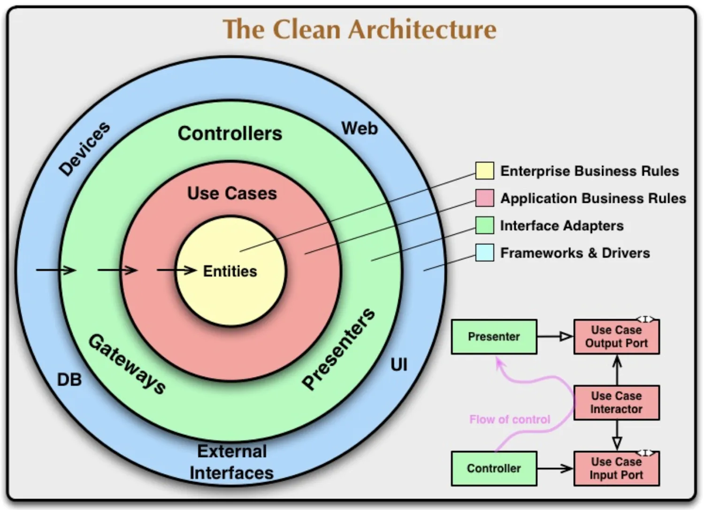

# Clean Architecture

- # Folder style 1 😌
<pre>
.
├── adapters
├── domain
│   ├── transaction
│   │   ├── transaction.entity.ts
│   │   ├── transaction.model.ts
│   │   └── transaction.repository.ts
│   └── user
├── presentations
│   ├── transaction
│   │   ├── TransactionCreate
│   │   │   ├── style.css
│   │   │   └── TransactionCreate.tsx
│   │   └── TransactionList
│   │       ├── style.css
│   │       ├── TransactionItem.tsx
│   │       └── TransactionList.tsx
│   └── user
├── use-cases
│   ├── transaction
│   │   ├── createTransactionUseCase.ts
│   │   ├── deleteTransactionUseCase.ts
│   │   └── listTransactionUseCase.ts
│   └── user
├── utils
│   ├── exceptionUtil.ts
│   └── toastUtil.ts
├── App.tsx
</pre>
- # Folder style 2 ❤️
<pre>
.
├── modules
│   ├── transaction
│   │   ├── apdapter
│   │   │   ├── createTransactionAdapter.ts
│   │   │   └── deleteTransactionApdapter.ts
│   │   ├── presentation
│   │   │   ├── TransactionCreate
│   │   │   │   ├── style.css
│   │   │   │   └── TransactionCreate.tsx
│   │   │   └── TransactionList
│   │   │       ├── index.tsx
│   │   │       ├── style.css
│   │   │       ├── TransactionItem.tsx
│   │   │       └── TransactionList.tsx
│   │   ├── use-case
│   │   │   └── spendMoreThanIncomeUseCase.ts
│   │   ├── config.ts
│   │   ├── transaction.entity.ts
│   │   ├── transaction.model.ts
│   │   └── transaction.repository.ts
│   └── user
├── utils
│   ├── dateUtils.ts
│   ├── exceptionUtil.ts
│   └── toastUtil.ts
├── App.tsx
</pre>